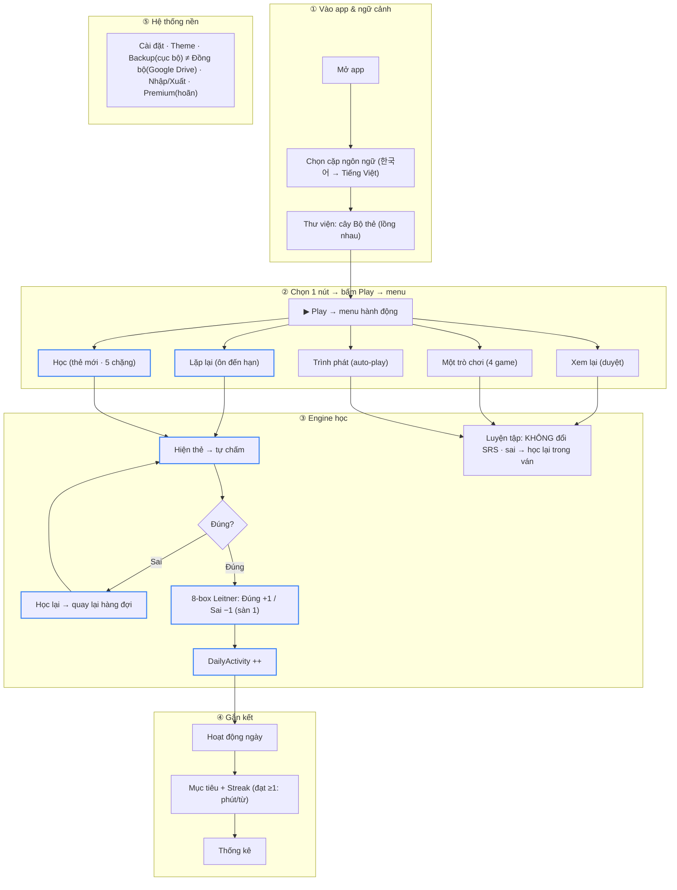

# Sơ đồ luồng toàn hệ thống — MemoX V4

**Status:** Specified

Bản hợp nhất luồng runtime của toàn hệ thống, chia **5 vùng**. Là nguồn chân lý cho
"bức tranh lớn"; chi tiết từng phần nằm ở các spec được truy vết bên dưới.

## Sơ đồ

Viền xanh (`srs`) = nhánh **đổi lịch SRS** (Lặp lại + Học). Còn lại là luyện tập / nền.

## Đọc theo vùng

1. **Vào app & ngữ cảnh** — mọi nội dung thuộc một cặp ngôn ngữ; thư viện là cây
   Bộ thẻ (lồng nhau) → Thẻ. Dữ liệu: `LanguagePair → Deck (tự lồng) → Card → SrsState (8 ô)`.
2. **Hành động tại 1 nút** — bấm Play mở menu 5 mục; "Lặp lại" chỉ hiện khi có thẻ đến hạn.
3. **Engine học** — nhánh SRS (Lặp lại/Học): hiện thẻ → tự chấm → Đúng +1 ô / Sai −1 ô
   (8-box) → cộng hoạt động; **sai ở mọi mode → học lại đến hết**. NewLearn = chuỗi 5
   chặng, thẻ mới vào ô1 sau khi đủ 5 chặng. Nhánh luyện tập không đổi SRS.
4. **Gắn kết** — hoạt động ngày → mục tiêu + streak → thống kê.
5. **Hệ thống nền** — cài đặt, theme, backup (cục bộ) ≠ đồng bộ (Google), nhập/xuất; Premium hoãn v1.

## Truy vết (vùng → spec / decision rows)

| Vùng | Spec | Dòng quyết định |
| --- | --- | --- |
| ② menu · Lặp lại · Học · Trình phát | `docs/business/study/study-flow.md` | D-001, D-002, D-010, D-014, D-016, D-029 |
| ③ SRS 8-box · Đúng+1/Sai−1 · học-lại | `docs/business/srs/srs-review.md` | D-003, D-004, D-005, D-015, D-018 |
| ② 4 game (picker) | `docs/business/game/game-modes.md` | D-008, D-013 |
| ④ hoạt động · mục tiêu · streak | `docs/business/engagement/dashboard-engagement.md` | D-010, D-021 |
| ⑤ nền | `docs/business/{settings/settings,account-sync/account-sync,import-export/import-export,personalization/personalization}.md` | D-012, D-025, D-026, D-027 |
| Dữ liệu | `docs/database/schema-contract.md` | — |

## Related

- `docs/business/system/overview.md` — tổng quan & bảng trạng thái
- `docs/business/index.md` — danh sách tính năng
- `docs/decision-tables/core-decision-table.md` — D-001…D-029
